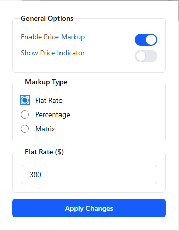

# Markup Matrix

<div align="center">
<picture>
    <source media="(prefers-color-scheme: dark)" srcset="./public/markupmatrix.png" />
    <source media="(prefers-color-scheme: light)" srcset="./public/markupmatrix.png" />
    
</picture>

A Chrome extension that automatically applies customizable markups to prices on various e-commerce websites including Amazon, AliExpress, and Snap-on EPC.


</div>

## Features

- **Multi-Platform Support**: Works with Amazon, AliExpress, and Snap-on EPC
- **Flexible Markup Options**:
  - Flat rate markup
  - Percentage-based markup
  - Matrix-based markup with customizable price ranges
- **Real-time Price Updates**: Automatically updates prices as you browse
- **Visual Indicators**: Option to show markup indicators on updated prices
- **Precise Calculations**: Handles decimal arithmetic accurately
- **Individual Part Pricing**: Correctly calculates totals based on marked-up individual parts

## Installation

1. Clone this repository
2. Open Chrome and navigate to `chrome://extensions/`
3. Enable "Developer mode" in the top right
4. Click "Load unpacked" and select the project directory

## Usage

1. Click the extension icon to open the settings panel
2. Configure your markup preferences:
   - Enable/disable the extension
   - Choose markup type (flat, percentage, or matrix)
   - Set markup rates
   - Toggle price indicators
3. Navigate to supported websites to see prices automatically updated

## Supported Websites

- **Amazon**: Updates product prices and totals
- **AliExpress**: Updates product prices and totals
- **Snap-on EPC**: Updates individual part prices and totals

## Price Calculation Examples

### Individual Part Markup
- Original price: $10.00
- Markup: $5.00
- New price: $15.00

### Total Calculation
- Part 1: $10.00 + $5 markup = $15.00
- Part 2: $10.00 + $5 markup = $15.00
- Total: $30.00 (sum of marked-up prices)

## Development

### Project Structure
```
src/
  ├── content.tsx        # Main content script
  ├── popup.tsx          # Extension popup UI
  ├── background.ts      # Background script
  ├── types.ts           # TypeScript type definitions
  └── utils/
      ├── amazonPrice.ts    # Amazon price handling
      ├── aliExpressPrice.ts # AliExpress price handling
      └── snapOnPrice.ts    # Snap-on EPC price handling
```

### Building
1. Install dependencies:
   ```bash
   npm install
   ```
2. Build the extension:
   ```bash
   npm run build
   ```

## Contributing

1. Fork the repository
2. Create a feature branch
3. Commit your changes
4. Push to the branch
5. Create a Pull Request

## License

This project is licensed under the MIT License - see the LICENSE file for details.

